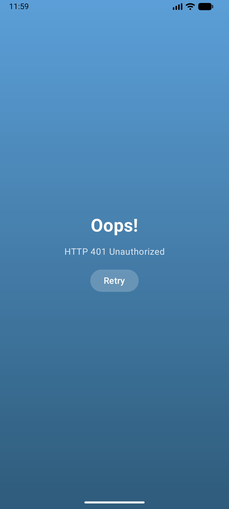

# Weather App DVT

A modern Android weather application built with Jetpack Compose, demonstrating Clean Architecture principles and MVVM pattern. This app provides real-time weather data, forecasts, and location search functionality using the OpenWeatherMap One Call API 3.0.

## Architecture

This application follows **Clean Architecture** principles with three distinct layers:

### Data Layer
- **Models**: Data classes for API responses and domain entities
- **Remote**: Retrofit API interface and network configuration
- **Repository Implementation**: Concrete implementation of repository interfaces with error handling

### Domain Layer
- **Repository Interface**: Abstract contracts defining data operations
- **Use Cases**: Business logic (implicitly handled through repository)

### Presentation Layer
- **ViewModels**: State management using StateFlow and business logic coordination
- **UI Components**: Jetpack Compose screens and reusable components
- **State Classes**: UI state representations

### MVVM Pattern
The app implements the Model-View-ViewModel pattern:
- **Model**: Data layer (repository, API, models)
- **View**: Composable UI components
- **ViewModel**: Manages UI state and coordinates data flow using Kotlin Flows

## Project Structure

```
app/src/main/java/com/simphiweradebe/weatherappdvt/
├── data/
│   ├── models/              # Data models for API responses
│   │   ├── OneCallResponse.kt
│   │   ├── GeoLocation.kt
│   │   └── ...
│   ├── remote/              # Network layer
│   │   └── WeatherApi.kt
│   └── repository/          # Repository implementations
│       └── WeatherRepositoryImpl.kt
├── di/                      # Dependency injection modules
│   ├── AppModule.kt
│   └── NetworkModule.kt
├── domain/
│   └── repository/          # Repository interfaces
│       └── WeatherRepository.kt
├── navigation/              # Navigation setup
│   ├── NavGraph.kt
│   └── Screen.kt
├── presentation/
│   └── screens/
│       ├── weather/         # Main weather screen
│       │   ├── WeatherScreen.kt
│       │   ├── WeatherViewModel.kt
│       │   ├── WeatherState.kt
│       │   └── components/
│       ├── forecast/        # Forecast detail screen
│       │   ├── ForecastDetailScreen.kt
│       │   └── components/
│       └── search/          # Location search
│           ├── SearchDialog.kt
│           ├── SearchViewModel.kt
│           └── SearchState.kt
├── utils/                   # Utility classes
│   ├── Constants.kt
│   ├── LocationManager.kt
│   ├── Resource.kt
│   ├── WeatherBackgroundMapper.kt
│   └── WeatherIconMapper.kt
└── WeatherApplication.kt    # Application class
```

## Third-Party Dependencies

### Core Dependencies
- **Hilt (2.51.1)**: Dependency injection framework for Android
  - Provides compile-time verified dependency injection
  - Manages object lifecycle and scoping
  - Used for: ViewModels, Repository, API, and Retrofit instances

- **Retrofit (2.11.0)**: Type-safe HTTP client
  - Handles API requests and responses
  - Integrates with Kotlin Coroutines
  - Used for: OpenWeatherMap API communication

- **OkHttp (4.12.0)**: HTTP client
  - Provides logging interceptor for debugging
  - Connection pooling and request/response intercepting
  - Used for: Network request logging and monitoring

- **Kotlin Serialization (1.6.3)**: JSON serialization/deserialization
  - Type-safe JSON parsing
  - Kotlin-first alternative to Gson/Moshi
  - Used for: API response parsing

### Jetpack Components
- **ViewModel**: UI state management and lifecycle awareness
- **Navigation Compose**: Screen navigation between weather and forecast detail screens
- **Hilt Navigation Compose**: ViewModel integration with Compose

### Location Services
- **Google Play Services Location (21.3.0)**: GPS and location services
  - FusedLocationProviderClient for accurate location
  - Runtime permission handling
  - Used for: Current location weather detection

### Coroutines & Flow
- **Kotlin Coroutines**: Asynchronous programming
  - Handles background operations
  - Used for: API calls and data streaming

- **Kotlin Flow**: Reactive data streams
  - StateFlow for state management
  - Used for: Repository to ViewModel data flow

### Testing Dependencies
- **MockK (1.13.8)**: Mocking framework for Kotlin
  - Provides relaxed mocks and DSL for test setup
  - Used for: Unit testing ViewModels and Repositories

- **Turbine (1.0.0)**: Flow testing library
  - Simplifies testing of Kotlin Flows
  - Used for: Testing StateFlow emissions

- **Coroutines Test (1.8.1)**: Testing utilities for coroutines
  - Test dispatchers and runTest scope
  - Used for: Testing suspend functions

### Code Quality Tools
- **Detekt (1.23.6)**: Static code analysis
  - Enforces code style and complexity rules
  - Custom configuration in `app/config/detekt.yml`

- **JaCoCo**: Code coverage reporting
  - XML and HTML coverage reports
  - Excludes generated files and data models

## Features

### Weather Data
- Real-time weather data for any location
- Current location detection using GPS with runtime permissions
- Current weather conditions with detailed metrics
- Hourly weather forecast (up to 48 hours)
- Daily weather forecast (up to 8 days)
- Weather alerts and warnings

### User Interface
- Dynamic weather backgrounds (Sunny, Cloudy, Rainy, Forest)
- Detailed forecast screen with smooth temperature graph (Bezier curves)
- Location search with autocomplete
- Custom weather icons for different conditions
- Gradient UI design with modern Material 3 components
- Navigation between weather and forecast detail screens

### Technical Features
- Error handling with retry functionality
- Loading states and empty states
- Comprehensive unit tests (16 tests covering ViewModels and Repository)
- CI/CD pipeline with GitHub Actions
- Static code analysis with Detekt
- Code coverage reporting with JaCoCo

## Build Instructions

### Prerequisites
- Android Studio Hedgehog or later
- JDK 17 or later
- Android SDK 34
- Minimum SDK 26 (Android 8.0)

### Setup

1. Clone the repository:
```bash
git clone https://github.com/SimiSips/Weather-App-DVT.git
cd WeatherAppDVT
```

2. Open the project in Android Studio

3. Configure API Key:
   - Open `app/src/main/java/com/simphiweradebe/weatherappdvt/utils/Constants.kt`
   - Replace the API_KEY value with your OpenWeatherMap API key
   - Note: Requires OpenWeatherMap One Call API 3.0 subscription

4. Sync Gradle:
   - Click "Sync Project with Gradle Files" in Android Studio
   - Or run: `./gradlew build`

5. Run the app:
   - Select a device/emulator
   - Click the "Run" button or press Shift+F10

### Build Variants
```bash
# Debug build
./gradlew assembleDebug

# Release build
./gradlew assembleRelease

# Run unit tests
./gradlew testDebugUnitTest

# Run static analysis
./gradlew detekt

# Generate code coverage report
./gradlew jacocoTestReport

# Run all checks (build, test, lint, detekt)
./gradlew check

# Clean build
./gradlew clean build
```

### Test Reports
After running tests and coverage:
- **Test results**: `app/build/reports/tests/testDebugUnitTest/index.html`
- **Coverage report**: `app/build/reports/jacoco/jacocoTestReport/html/index.html`
- **Detekt report**: `app/build/reports/detekt/detekt.html`

## API Configuration

This app uses the **OpenWeatherMap One Call API 3.0**, which requires a paid subscription:

1. Sign up at [OpenWeatherMap](https://openweathermap.org/)
2. Subscribe to "One Call by Call" plan (pay-as-you-go)
3. Generate an API key (takes 10-30 minutes to activate)
4. Update the API_KEY in `Constants.kt`

### API Endpoints Used
- **One Call API 3.0**: Weather data (current, hourly, daily, alerts)
  - `https://api.openweathermap.org/data/3.0/onecall`

- **Geocoding API**: Location search and coordinate conversion
  - `https://api.openweathermap.org/geo/1.0/direct`

## Technical Notes

### Design Patterns
- **Repository Pattern**: Abstracts data sources from the rest of the app
- **Singleton Pattern**: Used for network and repository instances via Hilt
- **Observer Pattern**: Implemented through Kotlin StateFlow for reactive UI updates

### State Management
- Uses `StateFlow` for unidirectional data flow
- Each screen has its own state class encapsulating UI state
- ViewModels expose immutable state to UI components

### Error Handling
- Network errors are wrapped in `Resource` sealed class
- Three states: Loading, Success, Error
- Repository layer handles exceptions and converts to user-friendly messages
- Retry functionality for failed requests

### Custom Components
- Weather icon mapper for condition-based icons
- Custom gradient backgrounds
- Reusable weather cards and forecast items
- All UI built with Jetpack Compose (no XML layouts)

### Code Quality & Testing
- **CI/CD Pipeline**: GitHub Actions workflow for automated builds and tests
- **Unit Testing**: 16 comprehensive tests covering ViewModels and Repository
  - WeatherViewModelTest: 5 tests (loading, success, error, location, retry)
  - WeatherRepositoryImplTest: 5 tests (API flows and error handling)
  - SearchViewModelTest: 5 tests (search functionality)
- **Static Analysis**: Detekt with custom rules for code quality
  - Complexity thresholds: LongMethod (60), ComplexMethod (15)
  - Max line length: 120 characters
- **Code Coverage**: JaCoCo reports with XML and HTML output
- **Dependency Management**: Version catalog (`libs.versions.toml`)
- **Build Configuration**: Kotlin DSL for Gradle
- **Error Handling**: Proper handling at all architectural layers
- **Type Safety**: KAPT error type correction enabled

### Network Security
- All API endpoints use HTTPS
- Internet permission declared in AndroidManifest
- Network security policy compliant

## Screenshots
 
 
 
### Main Weather Screen
- Custom header with search and current location icons
- Large centered weather icon display
- Prominent temperature display (96sp)
- City name display showing current location
- Wind and humidity metrics section
- Horizontal scrolling hourly forecast
- Dark card design for weather details
- "Next 7 Days" button for forecast details
- Location search dialog with autocomplete results

### Forecast Detail Screen
- Dynamic weather backgrounds based on conditions (Sunny, Cloudy, Rainy, Forest)
- Back navigation to main screen
- Large weather icon with current temperature
- Smooth temperature graph with Bezier curves (8-hour forecast)
- "Feels Like" and "Humidity" metric cards
- Wind speed and direction card
- Humidity percentage card with icon
- Weather alerts section (when available)
- Weekly forecast list (7 days) with min/max temperatures

## CI/CD Pipeline

The project includes a GitHub Actions workflow (`.github/workflows/android-ci.yml`) that automatically:

1. **Code Quality Check**: Runs Detekt static analysis
2. **Build**: Compiles the project for both debug and release variants
3. **Test**: Executes all unit tests
4. **Coverage**: Generates JaCoCo code coverage reports
5. **Artifacts**: Uploads test results and coverage reports

The pipeline runs on:
- Push to `main` branch
- Pull requests to `main` branch

## License

This project was created as part of a technical assessment for DVT.
Created by Simphiwe Radebe.
